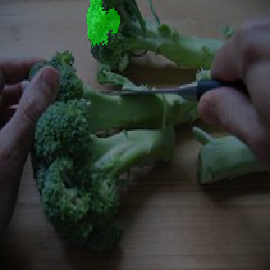

# MALCC
LIMEという予測結果の解釈を画像分類のRGBチャンネルに拡張したデモになります。

cat.jpg(元画像)


↑をtiger catと推定するときの重要領域と色を可視化することができます。



顔のうち耳の緑(G)を分類根拠として使っているようです。

# 使い方

clone
```
git clone https://github.com/tsutsu-22/MALCC
```

パッケージは以下でインストールできます。
※gpuがない方はrequirements.txtの中のtensorflow-gpuをtensorflowに変更してください。
```
pip install -r requirements.txt
```

パラメータや画像の設定→下記paramsを参照

以下を実行する。
```
python main.py
```


## params
以下の内容を変更することが可能です。
```python
  ####param####
  num_pattern=500  #重回帰分析のパターン数
  name='angora3'　#入力画像名
  img=f'images/{name}.jpg'
  svdir=f'results/{name}'
  savename='test_output'
  ths=[0.05,0.03,0.01,0.005,0.001] #上位何％を保存するか
  #############
```
num_pattern...マスク画像を何パターン作るか、多いほど正確になるが、計算時間が増える

img...入力画像のパス、ImageNetで分類したいものを同ディレクトリに置いてここに記述

svdir...結果をどのディレクトリに保存するか

savename...結果の画像名

th...重要領域と色を上位何％まで表示するか


### 参考
大まかな流れは↓を参考

https://ascii.jp/elem/000/004/007/4007762/

ImageNetの画像は↓から取得

https://starpentagon.net/analytics/ilsvrc2012_class_image/

LIMEのgit↓

https://github.com/marcotcr/lime/tree/73f03130b1fa8dbb3378457e78c82d4889942f83


